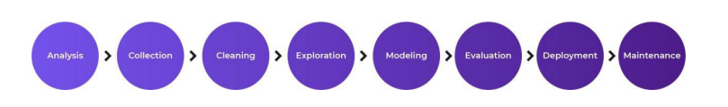

# Proyecto Fabrica de Automóviles

Eres un director de proyecto en un importante fabricante de automoviles .tu objetivo es reducir 
el consumo de energia.un grupo de investigacion ya ha realizado varios analisis exhaustivos y ha descubierto que una forma de abordar el problema es utilizar la IA para anticipar el consumo futuro de energia

la etapas del proyecto de IA son:

 (Image URL)

1.`Analysis (Análisis):`
En esta fase, nos enfocamos en comprender a fondo el problema del alto consumo de energía en la fábrica. Identificamos las áreas clave de consumo, los procesos involucrados y los factores que influyen en el gasto energético. También definimos los objetivos específicos del proyecto, como el porcentaje de reducción de consumo deseado.  

2.`Collection (Recolección de datos):`  
Aquí recopilamos todos los datos relevantes para el proyecto. Esto puede incluir:  
- Registros históricos de consumo de energía  
- Información sobre la Datos de producción  
- Información sobre el funcionamiento de maquinaria y equipos  
- Factores ambientales (temperatura, humedad)  
- Horarios de trabajo y turnos  
- Mantenimiento de equipos  

3.`Cleaning (Limpieza de datos):`  
En esta etapa, procesamos los datos recolectados para asegurar su calidad y utilidad:  
- Eliminamos valores atípicos y erróneos  
- Tratamos los datos faltantes  
- Estandarizamos formatos  
- Corregimos inconsistencias  
- Eliminamos duplicados  

4.`Exploration (Exploración de datos):`  
Realizamos un análisis exploratorio de los datos para obtener insights:  
- Visualizamos patrones de consumo energético  
- Identificamos correlaciones entre variables  
- Detectamos tendencias temporales  
- Analizamos la distribución del consumo por áreas o procesos  

3.`Modeling (Modelado):`  
Desarrollamos modelos de IA para predecir y optimizar el consumo energético:  
- Seleccionamos algoritmos apropiados (ej. redes neuronales, random forests)  
- Entrenamos modelos predictivos de consumo energético  
- Desarrollamos modelos de optimización para sugerir ajustes en procesos  
- Implementamos técnicas de aprendizaje por refuerzo para optimización continua  

4.`Evaluation (Evaluación):`  
Evaluamos el desempeño de nuestros modelos:  
- Utilizamos métricas como MAE, RMSE para modelos predictivos 
- Realizamos validación cruzada  
- Comparamos con modelos base (baselines)   
- Evaluamos el impacto potencial en la reducción del consumo energético 

5.`Deployment (Implementación):`
Ponemos en marcha el sistema de IA en la fábrica:   
- Integramos los modelos con los sistemas existentes  
- Desarrollamos interfaces para que los operadores interactúen con el sistema  
- Implementamos un sistema de monitoreo en tiempo real  
- Capacitamos al personal sobre el uso del nuevo sistema  

6.`Maintenance (Mantenimiento):`  
Aseguramos el funcionamiento continuo y la mejora del sistema:  
- Monitoreamos el rendimiento de los modelos  
- Realizamos actualizaciones periódicas con nuevos datos  
- Ajustamos los modelos según cambios en procesos o equipos  
- Implementamos un sistema de retroalimentación para mejora continua  

### Glosario

`Error absoluto medio, mean absolute error (MAE)`  
Esta métrica es una medida de la diferencia entre dos valores, es decir, nos permite saber que tan diferente es el valor predicho y el valor real u observado. Para que un error con valor positivo no cancele a un error con error negativo usamos el valor absoluto de la diferencia. Como nos interesa conocer el comportamiento del error de todas las observaciones y no solamente de una, entonces obtenemos el promedio de los valores absolutos de la diferencia.

`Raíz del error medio cuadrado, root mean square error (RMSE)`
Como la métrica anterior nos da el resultado en unidades cuadradas, para poder interpretarlo más fácilmente sacamos la raíz cuadrada y de esta manera tenemos el valor en las unidades originales.

