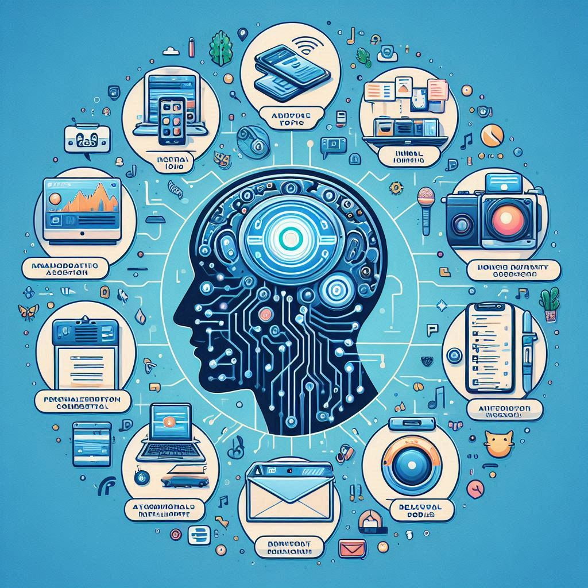
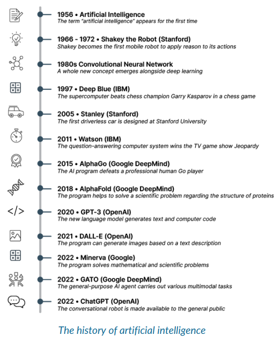

# ¿Que es la inteligencia artificial?

## Capitulo 1 - Identificar aplicaciones comunes de la inteligencia artificial

La inteligencia artificial (IA) es una tecnología que permite a las máquinas realizar tareas que requieren inteligencia humana. Está integrada en nuestra vida cotidiana de diversas maneras: por la mañana, las redes sociales utilizan IA para personalizar tu feed de noticias; aplicaciones de música como Spotify te recomiendan canciones basadas en tus gustos; los servicios de correo electrónico sugieren respuestas automáticas; las cámaras de los smartphones optimizan las fotos automáticamente; LinkedIn te sugiere empleos relevantes; aplicaciones de mapas como Google Maps proporcionan actualizaciones de tráfico en tiempo real; y los sitios de comercio electrónico como Amazon te recomiendan productos basados en tus compras anteriores. La IA mejora y personaliza nuestra experiencia diaria de múltiples formas.

 (Generated with AI)

A estas alturas, probablemente te hayas dado cuenta de que la IA está en todas partes en tu vida diaria. Pero, ¿qué es la IA? Según Yann LeCunn, Científico Jefe de IA en Meta, la inteligencia artificial es cualquier tecnología de la información capaz de resolver problemas complejos que normalmente se atribuirían a humanos y animales. No es una tecnología única, sino un término general que abarca muchas tecnologías diferentes, algunas de las cuales aprenderás en la siguiente sección de este curso.

 (The History of AI)