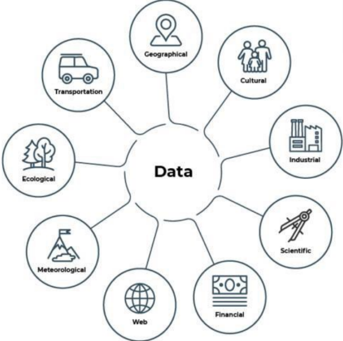
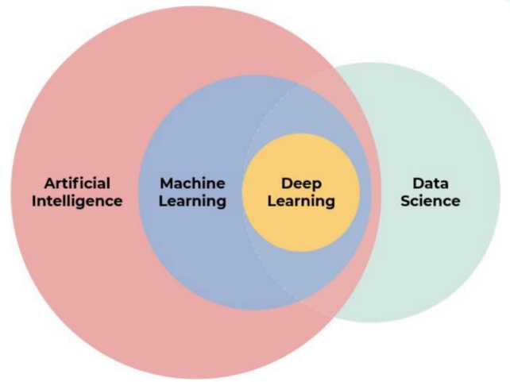

# Capitulo 2 - Familiarízate con los conceptos clave asociados a la Inteligencia Artificial

## 2.1 ¿Qué es Big Data?

Big Data se refiere a la enorme cantidad de datos generados constantemente por actividades humanas y dispositivos, tanto en internet como en el mundo físico. Estos datos abarcan diversos tipos como números, texto, video y audio. La explosión de datos ha llevado al concepto de Big Data, caracterizado por su enorme volumen. Cada minuto, se realizan millones de búsquedas en Google, se ven millones de videos en YouTube y se intercambian millones de correos electrónicos, contribuyendo todos a este fenómeno. Big Data es esencial para la inteligencia artificial, ya que proporciona la vasta cantidad de información necesaria para que las máquinas aprendan y realicen tareas complejas.

 

## 2.2 ¿Para qué se utiliza el Big Data?

Las organizaciones utilizan el Big Data para analizar la enorme cantidad de datos que generan. Este análisis es realizado por profesionales especializados en la ciencia de datos, conocida como científicos de datos. Esta profesión es una de las más demandadas hoy en día. Un científico de datos en una cadena de tiendas de ropa, por ejemplo, analiza las ventas pasadas e identifica las colecciones más propensas a vender en el futuro. Para ello, necesita habilidades en matemáticas y estadística, conocimientos informáticos y una comprensión del sector específico. El resultado de su análisis permite desarrollar herramientas para predecir automáticamente las tendencias de ventas futuras.

## 2.3 Más sobre Machine Learning y Deep Learning

**El Machine Learning**, una subdisciplina de la inteligencia artificial, permite que un programa de computadora realice tareas sin estar explícitamente programado para ellas, aprendiendo a partir de datos proporcionados. Similar al aprendizaje de un niño, el programa necesita ver numerosos ejemplos para entender y ejecutar una tarea correctamente. Para profundizar en esto, consulta la sección dedicada a los fundamentos del Machine Learning.

**El Deep Learning**, basado en redes neuronales artificiales inspiradas en el cerebro humano, se usa frecuentemente con grandes volúmenes de datos. Maneja grandes cantidades de ejemplos y logra resultados superiores en comparación con otros métodos tradicionales de inteligencia artificial. Es especialmente útil para datos de voz, como los utilizados por asistentes virtuales para interpretar y traducir preguntas en texto, una técnica conocida como procesamiento automático del lenguaje natural.

## 2.4 Amplía tu definición de Inteligencia Artificial

La inteligencia artificial (IA) y la robótica son campos fascinantes que a menudo se confunden debido a su interrelación en muchos proyectos. Vamos a explorar un poco más estos conceptos clave:

**Algoritmos y su Importancia**
Los algoritmos son fundamentales en la IA y el aprendizaje automático (Machine Learning). Un algoritmo es una secuencia de instrucciones claras y precisas para resolver un problema o realizar una tarea específica. La analogía con una receta de cocina es acertada: al igual que una receta guía al cocinero a través de los pasos necesarios para preparar un platillo, un algoritmo guía a un sistema de IA a través de los pasos necesarios para alcanzar un objetivo específico.  

**Definición Ampliada de IA**
Originalmente, definimos la IA como cualquier tecnología de la información capaz de resolver problemas complejos normalmente asociados con la inteligencia humana y animal. Ahora, podemos expandir esta definición para incluir la naturaleza algorítmica de la IA, subrayando que se trata de tecnologías de información algorítmica que pueden realizar tareas de percepción, razonamiento y acción.  

`Diferencia entre IA y Robótica
Robótica:`

La robótica se centra en la mecánica y en la construcción de robots.
Los robots utilizan sensores para interactuar con su entorno, como micrófonos y altavoces para grabar y emitir sonidos.
La mayoría de los robots no son humanoides; muchos son diseñados para tareas específicas, como los robots industriales.

`Inteligencia Artificial:`

La IA dota a los robots y otros sistemas de la capacidad de realizar tareas complejas de forma autónoma.
Los sistemas de IA pueden funcionar independientemente de los robots, como en el caso de los asistentes de voz en teléfonos inteligentes.  
La IA permite a los robots realizar tareas como la navegación autónoma.
Resumen de Conceptos Clave   
`Big Data:` Se refiere a la gran cantidad de datos generados diariamente, como correos electrónicos y fotos.  
`Ciencia de Datos e IA:` Son campos interrelacionados que utilizan técnicas de Machine Learning y Deep Learning para analizar y extraer valor de grandes volúmenes de datos.  
`Diferenciación de Campos:` La IA y la robótica son disciplinas distintas pero a menudo trabajan juntas en proyectos. La IA se centra en el procesamiento y análisis de información, mientras que la robótica se ocupa de la construcción y control de robots.  
`Próximos Pasos`
Con esta comprensión básica, estaremos mejor preparados para abordar algunos de los mitos más comunes sobre la inteligencia artificial en el próximo capítulo. 

[volver al inicio](README.md)