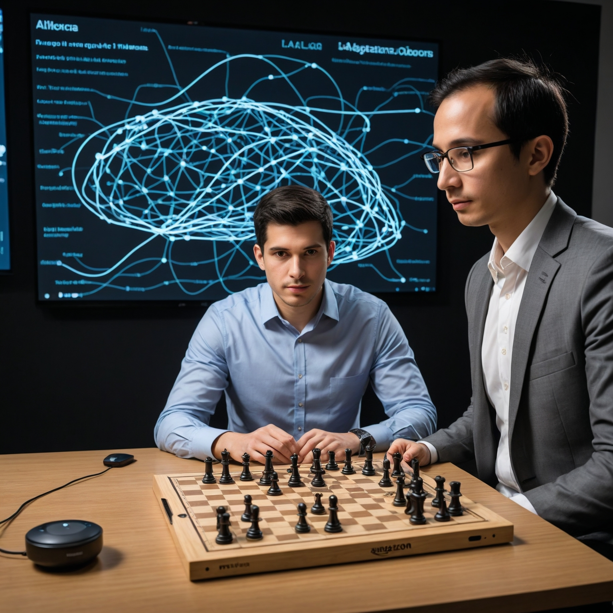

# Capitulo 3 - Ver más allá de los mitos: Descubre el verdadero poder de la Inteligencia Artificial

## Capitulo 3.1 - Desmitificando mitos comunes en torno a la IA

 (Generated of AI)

  
La inteligencia artificial (IA) se ha integrado en nuestra vida cotidiana, con ejemplos notables como AlphaGo, Sophia, coches autónomos y ChatGPT. Sin embargo, la representación de la IA en la cultura popular a menudo está llena de mitos y exageraciones.

**Mito No. 1: “Los Programas de IA son más inteligentes que los humanos”**  
Los programas de IA pueden realizar tareas específicas de manera excepcional, como jugar juegos de mesa o identificar especies en videos.  
No obstante, estos programas no son copias del cerebro humano y son altamente especializados, no poseen la inteligencia general humana.  
Se distingue entre IA estrecha (especializada en tareas específicas) y IA general (que podría aplicar conocimientos en diversas áreas), siendo la mayoría de los avances actuales en IA estrecha.

**Mito No. 2: “La IA funciona igual que el cerebro humano”**  
Aunque las redes neuronales y el Deep Learning se inspiran en el cerebro humano, la IA opera de manera muy diferente.
La IA puede superar a los humanos en tareas específicas como cálculos matemáticos y memoria, pero carece de capacidades como emoción, empatía y humor.
Algunas aplicaciones, como Amazon Alexa, pueden simular emociones para interactuar mejor con los usuarios, pero estas emociones no son reales.
