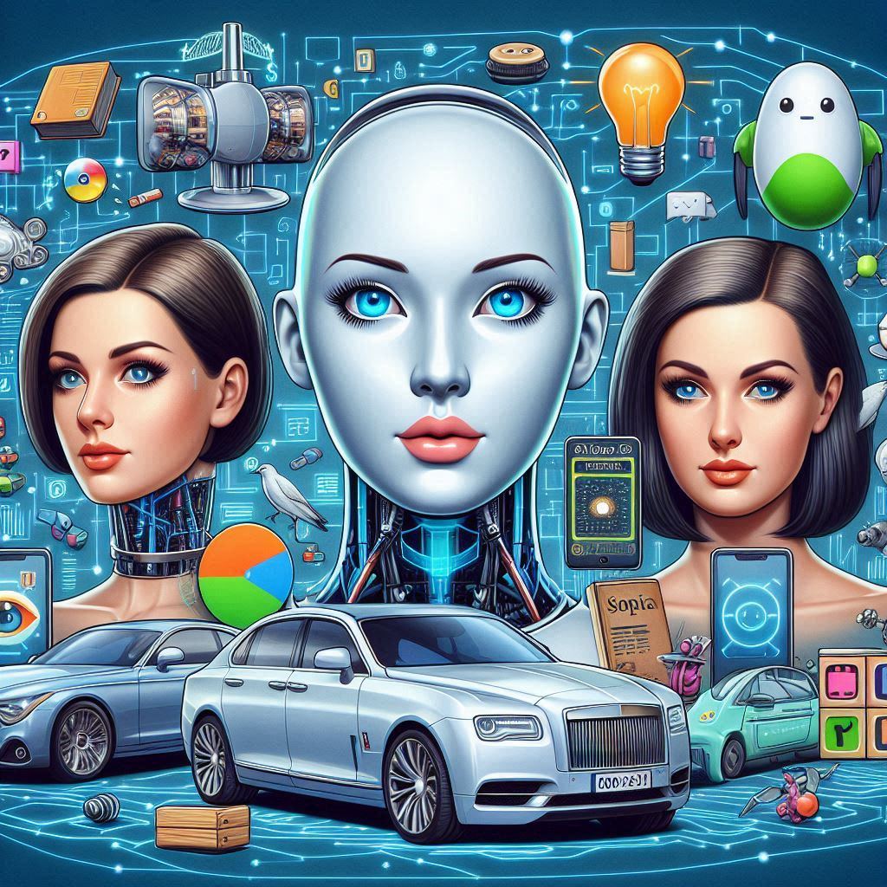

# Capitulo 4 - Descubre las oportunidades que ofrece la Inteligencia Artificial

## 4.1 - Detección temprana de enfermedades

La inteligencia artificial (IA) es una tecnología prometedora que puede abordar grandes desafíos en medicina, educación y medio ambiente, aprovechando la colaboración entre diversos campos como la inteligencia artificial, la industria, la sociedad civil y el emprendimiento.  

**Iniciativa "AI for Good"**  
"AI for Good": Una cumbre mundial anual patrocinada por las Naciones Unidas desde 2017, que muestra aplicaciones prometedoras de la IA en salud, educación y medio ambiente.  
 
`Cáncer de mama:` La IA puede detectar la enfermedad en etapas tempranas, superando la capacidad visual de los médicos. Un equipo del MIT desarrolló un programa que puede predecir el riesgo de cáncer de mama hasta cuatro años antes que los métodos tradicionales, entrenado con 90,000 mamografías y datos de 60,000 pacientes.
Desarrollo de planes de tratamiento  
`Proyecto europeo DESIREE:` Utiliza IA para apoyar a los médicos en la toma de decisiones sobre el tratamiento del cáncer de mama, analizando la información de los pacientes en comparación con miles de casos previos. La constante incorporación de nuevos casos permite personalizar los tratamientos y mejorar las tasas de curación.
Ampliación del acceso a la atención médica  
`Babylon Health:` Plataforma de atención médica virtual en el Reino Unido y Ruanda, en colaboración con Telus, que ofrece servicios médicos accesibles y asequibles mediante IA. La aplicación "Babylon by Telus Health" incluye un chatbot de IA para verificar síntomas y guiar a los usuarios en la toma de decisiones médicas basadas en datos. La aplicación, disponible en inglés y francés, se basa en más de 500 millones de flujos de conocimiento médico.

 (Generated of AI)

## 4.2 - Iniciativas en educación 
 
La inteligencia artificial (IA) está revolucionando las aulas al mejorar significativamente el rendimiento estudiantil a través de aplicaciones innovadoras.  

Ayudando a los estudiantes a aprender a escribir  
`Kaligo:` Una startup que, en respuesta a un llamado del Ministerio de Educación de Francia en 2013, desarrolló una aplicación para enseñar a escribir.  
`Desarrollo:` Tres años de investigación con el equipo IntuiDoc en IRISA y el INSA.  
`Funcionalidad:` Utiliza una tableta y un lápiz óptico para enseñar las letras del alfabeto y palabras simples.  
`IA en acción:` Analiza trazos basándose en forma, dirección, orden y velocidad, proporcionando retroalimentación en tiempo real.  
`Impacto:` La interfaz lúdica y eficaz ha convertido a Kaligo en un éxito en muchas aulas.  

**Apoyar la alfabetización**
`Square Panda:` Una startup estadounidense que diseñó un sistema de aprendizaje adaptativo y fonético multisensorial basado en IA.  
`Personalización:`Ajusta automáticamente el nivel de dificultad según el progreso del estudiante.  
`Funcionalidad:` Cuanto más utiliza el niño el sistema, mayor es la personalización del contenido.  
`Impacto:` Ofrece una experiencia de aprendizaje personalizada, mejorando la alfabetización. 

[volver al inicio](README.md)